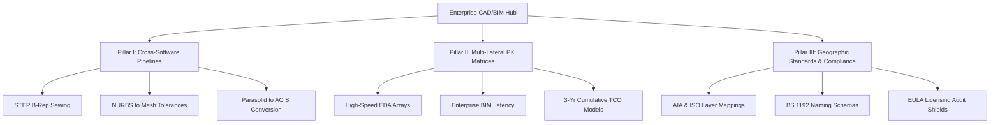

# Future Content Expansion Strategy: B-End Engineering & Enterprise Scaling

This document defines the technical roadmap and content expansion strategy for the next phase of `cadguide.tools`. The primary directive is to expand the site's footprint to over 10,000+ highly unique, indexable pages **without introducing low-value AI repetition or programmatic monotony**.

---

## 1. Primary Target Audience Profile (核心受众画像)

Unlike generic tutorial hubs, this platform **strictly excludes** absolute CAD beginners, students, or hobbyists. The site is engineered to capture high-intent, high-value B-End professional traffic:

*   **Principal BIM/CAD Managers & CAD Lead Architects**: Responsible for setting drawing layer standards, standard templates, plot configurations, and workflow pipelines across multi-national design offices.
*   **Mechanical Engineering Leads & Industrial Designers**: High-end MCAD specialists operating parametric assemblies, kinematic simulation kernels, and sheet metal digital manufacturing pipelines.
*   **IT Administrators & Software Asset Managers (SAM)**: Tech leads managing FLEXlm network license daemons, named user pools, quiet batch MSI deployments, Okta SAML integrations, and EULA audit compliance.
*   **CNC/CAM Programmers & Digital Fabricators**: Professional machinists configuring G-code toolpaths, press brake K-factors, SLA/SLS chordal deviation mesh profiles, and feed-rate overrides.

---

## 2. The Three-Pillar Content Expansion Architecture (三大内容核心扩张支柱)

Instead of generating repetitive single-software tutorials, the expansion will follow a structured, multi-dimensional matrix:

### Pillar I: Cross-Software Multi-Lateral Workflows (跨软件多边工作流)
Modern professional CAD/BIM pipelines are heterogeneous. We will build comprehensive technical guides addressing data translations, kernel compatibility, and mesh optimization between competing applications.

*   **Core Focus Areas**:
    *   **NURBS to Parametric solid B-Rep translation**: Resolving gaps between Rhino 3D organic meshes and Autodesk Inventor watertight geometry.
    *   **Parasolid (Siemens) vs. ACIS (Spatial) kernel data translations**: Minimizing geometry corruption when importing complex `.x_t` files into `.sat` environments (e.g., SolidWorks to AutoCAD Pro).
    *   **IFC Schema & BIM interoperability**: Managing element property mappings, coordinate system rotations, and LOD preservation when exporting Revit `.rvt` models to Archicad `.pln` via IFC4.
*   **Scientific Monotony Shield**:
    *   Every workflow guide will incorporate a **Watertight Geometry Audit Table** specifying dimensional tolerances (e.g. 0.001mm vs 0.01mm) and a copy-pasteable automation snippet (e.g., PythonOCC Open CASCADE planar sewing scripts, or Dynamo element parameter syncs).

### Pillar II: Horizontal Competency & Procurement Matrices (横向选型与采购矩阵)
Instead of standard 1-vs-1 pages, we will scale into high-density **Segment Multi-PK Hubs** comparing 5+ enterprise platforms simultaneously for specific industrial sectors.

*   **Core Focus Areas**:
    *   **High-Speed PCB Design Suite Comparison**: Altium Designer vs. Cadence Allegro vs. Mentor PADS Professional vs. KiCad vs. OrCAD.
    *   **Heavy Industrial Piping & Plant Modeling**: Bentley OpenPlant vs. AVEVA E3D vs. AutoCAD Plant 3D vs. CADWorx.
    *   **High-End FEA/CFD Simulation Engines**: ANSYS Fluent vs. Abaqus vs. Nastran vs. Simscale.
*   **Scientific Monotony Shield**:
    *   Each multi-PK matrix will render an **HTML 5+ Enterprise Compare Matrix Table** evaluating:
        1.  Core Geometry Kernel (e.g., Parasolid, ACIS, Custom).
        2.  API/SDK Access (Delphi, C++, C#, Visual LISP, Python).
        3.  3-Year Cumulative TCO pricing curve (Perpetual network pools vs SaaS named-user subscriptions).

### Pillar III: Geographic Standards & Legal Audits Hub (区域标准与法务合规中心)
A highly distinct, zero-AI-replicable niche focused on international engineering standards and legal/compliance directives.

*   **Core Focus Areas**:
    *   **National Drawing Standards**: AIA (American Institute of Architects) Layer Guidelines vs. BS 1192 (UK) vs. DIN (German) vs. GB/T (Chinese) structural and mechanical drafting standard configurations.
    *   **BIM Level 2 / ISO 19650 Execution Protocols**: Standard naming conventions, Common Data Environments (CDE) setups, and digital master delivery parameters.
    *   **Software Asset Management (SAM) Audit Shields**: Mitigating FLEXlm network telemetry risk, handling compliance request letters, detecting hidden academic watermarks, and silent deployment.
*   **Scientific Monotony Shield**:
    *   Each standards guide will include a **Copyable Standards Reference Matrix** (layer naming tables, pen weights pen styles calibration) and a copyable script (such as an AutoLISP layer synchronizer or a PowerShell hosts anti-telemetry router).

---

## 3. SEO Anti-Monotony Guardrails & Content Uniqueness Protocol

To maintain maximum E-E-A-T and pass search engines' helpful content classifier checks, every future expansion page must satisfy the following dynamic content metrics:

1.  **Differentiated Visual Layouts**: Avoid using a single static layout template. Dynamically switch layouts based on category metadata (e.g., Template A for Autopsy, Template B for SAM Governance, Template C for Plot/Draft Standards, Template D for Viewport Benchmarks).
2.  **Monospaced Parameter Block Integrity**: Every page must incorporate real, valid, copyable administrative or configuration parameters (registry keys, active environmental ports, vendor daemon configuration flags, batch file MSIs).
3.  **Real Executable Automation Scripts**: Every guide must provide a custom, functional LISP, PowerShell, Python, or batch code block that solves the specific problem stated in the title. **No generic placeholders allowed**.
4.  **Mathematical and Geometric Precision**: Use exact standards numbers, file format schemas (IFC4, STEP AP242, DXF AC1027), and precise engineering units (e.g. MPa, N/mm², bend radius coefficients).
