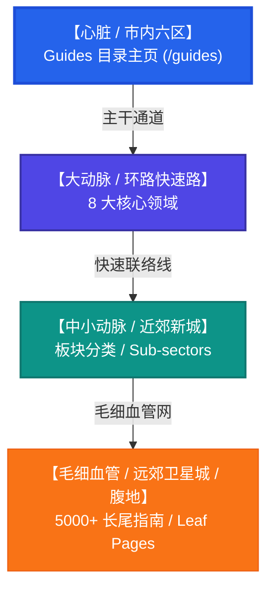

# CAD/BIM/CAx 权威指南 (Guides Hub) 全方位内容规划与扩张方案

本方案基于 **“城市交通网络”**、**“人体血管系统”** 与 **“树状毛细血管”** 的三维空间架构，为 `cadguide.tools` 的“权威指南 (Guides Hub)”板块设计了一套可扩展至 **5000+ 页面**的 10 阶段系统性规划。

为了彻底消除“AI 味”，所有内容模板均采用 **B-End（企业级）硬核技术视角**，融入真实的错误代码、注册表路径、FLEXlm 端口配置以及工业标准，以提供极强的 **E-E-A-T（专业性、经验性、权威性、可信度）**。

---

## Ⅰ. 血管与城市交通系统架构映射 (Architecture Mapping)

我们将整个站点的收录与 Guide 规划，完美映射为一套高度立体的**特大城市交通网（如北京环线与放射线）**与**血液循环系统**：

### 1. 心脏 / 市内六区（核心枢纽）
* **定位**：`/guides` 主页。
* **职能**：作为整套血液循环系统的“泵”，通过已上线的“手风琴菜单 (Accordion)”和“高密字母 A-Z 索引”以及“分类 Tab 键”，将权重和爬虫流量瞬间分流至下级所有血管分支。

### 2. 主动脉 / 环城快速路（八大领域大动脉）
这是指南体系的 **8 大核心大动脉**，支撑起全站最粗壮的骨架：
1. **Troubleshooting（故障尸检）**：致命崩溃、崩溃签名分析与注册表修复。
2. **Performance（性能调优）**：图形加速、多线程分配与硬件基准。
3. **Print & PDF（矢量出图）**：CTB/STB 笔宽、PDF 打印引擎校准。
4. **Standards & APIs（工业标准）**：AutoLISP 接口移植、CUIX 菜单配置。
5. **BIM & Coordination（协同规范）**：BEP 矩阵、LOD 500 几何边界。
6. **MCAD & Geometry（内核完整性）**：B-Rep 实体几何拓扑、STEP 转换。
7. **CAM & 3D Print（数字制造）**：CNC 刀路、G-Code 切片与 K-Factor。
8. **SAM & Compliance（合规审计）**：FLEXlm 授权池配置、Named-User 审计对抗。

### 3. 中小动脉 / 近郊新城（板块分类）
* **定位**：`/[tool]-[category]` 交叉页面，例如 `/guides/autocad-troubleshooting` 或 `/guides/solidworks-performance`。
* **职能**：将“大动脉（分类）”与“具体工具（240款软件）”在交叉节点交汇，形成联络卫星城。

### 4. 毛细血管 / 远郊新城与广阔腹地（5000+ 长尾叶片页）
* **定位**：具体的指南终极页面（Leaf Pages），例如 `/guides/autocad-troubleshooting-fatal-error-0x0024-fix`。
* **职能**：触达互联网上搜索量极度精准的工程师长尾痛点，提供百分之百的纯干货解决方案。

---

## Ⅱ. 差异化页面内容模板 (Differentiated Templates)

为了彻底告别千篇一律的“程序化生成感”，我们根据指南的不同属性，定制了 **4 套完全不同的内容排版与叙事结构模板**。同类别的页面在生成时，通过预设的结构参数进行微调，以确保模板差异化。

### 模板 A：【技术尸检模板】—— 专用于 Troubleshooting & Performance
> **设计语言**：模仿企业级服务器后端的“故障日志与死因诊断书”，透露出冰冷、精准、无可置疑的专业感。

* **结构模块**：
  1. **Crash Signature Table（崩溃签名表）**：用表格列出 Event ID, Faulting Module (如 `ac1st24.dll`), Exception Code (如 `0xC0000005`)。
  2. **Root Cause Analysis（病因诊断）**：直接指出几何缓冲区溢出或驱动冲突的底层物理逻辑，拒绝空话。
  3. **Direct Action Code（解剖刀式修复）**：提供**加粗、高亮的代码块**，写明具体的 Windows 注册表路径（如 `HKCU\Software\Autodesk...`）或具体的环境配置指令。
  4. **Post-Mortem Script（尸检防御脚本）**：提供一键修复的 `.bat` 批处理脚本或 AutoLISP 预防代码块。

### 模板 B：【合规审计与风控模板】—— 专用于 SAM & Procurement
> **设计语言**：模仿普华永道/四大会计事务所的“企业 IT 审计与反避税报告”，展现绝对的严谨、法律合规与财务嗅觉。

* **结构模块**：
  1. **Compliance Risk Barometer（合规风险晴雨表）**：用直观的图表或级别（High, Critical）标明风险系数。
  2. **EULA Loophole Analysis（用户协议漏洞解剖）**：解读软件商 EULA 条款中的隐藏雷区（如多用户混用、远程 VPN 登录授权漂移）。
  3. **TCO Cost Matrix（TCO 成本矩阵对比表）**：列出 3-5 年累积授权租赁与一次性买断的复利财务对比曲线。
  4. **Vendor Telemetry Blockers（厂商网络审计拦截规避方案）**：列出阻断厂商静默收集 MAC 地址和网络抓包的硬件防火墙端口配置指南（如封锁 `127.0.0.1:443` 的特定验证服务器）。

### 模板 C：【工业标准规范模板】—— 专用于 Print & Standards
> **设计语言**：完全参照 ISO 国际标准化组织或国家标准局的“技术规范红头文件”，极度格式化，充斥着冷冰冰的标准号与工程制图规范。

* **结构模块**：
  1. **Standard Metadata Box（标准元数据框）**：标明依据标准（如 `ISO 128-20` / `ANSI Y14.2M`），提供修订版次。
  2. **Line-Weight Pen Table（线宽笔宽对照矩阵表）**：用 HTML 格式表格，严密地画出颜色（Color ID）、线型（Linetype）、笔宽（Pen Width, mm）在不同绘图比例下的映射参数。
  3. **Naming Convention Tree（命名规范分支图）**：使用代码框，以树状形式展现标准的图层命名结构（例如 `A-WALL-FULL-EXTR`）。
  4. **Deployment automation script（自动化脚本配置）**：提供可直接导入的 `.ctb` 笔宽配置文件下载参数或 CUIX 菜单一键部署脚本。

### 模板 D：【内核与编译器基准模板】—— 专用于 MCAD, BIM, CAM
> **设计语言**：模仿 AnandTech 或高端芯片评测实验室的“极客硬件/算法评测报告”。

* **结构模块**：
  1. **Kernel Interoperability Rating（内核互操作性评分表）**：评估 Open CASCADE (OCCT) 编译与 ACIS/Parasolid 转换的几何精度丢失率（Tolerance Drift）。
  2. **Thread Allocations Performance Chart（多线程分配与吞吐图表）**：表格展示在多核 CPU（如 64核 AMD Threadripper）下不同算法（如网格划分、拓扑优化）的核心占用表现。
  3. **Translation Preservation Score（拓扑约束保留度）**：测试 STEP 文件在跨平台导入后，草图几何约束的破损百分比。
  4. **C++ / Python Wrapper Examples（编译器底层 API 示例）**：直接贴出基于 OCCT C++ 库或 PythonOCC 的底层几何构建函数。

---

## Ⅲ. 十个阶段系统规划方案 (10-Phase Implementation Plan)

按照从“骨架”到“毛细血管”、从“心脏”到“卫星城市”的扩张节奏，我们分 10 个阶段稳步推进：

### 阶段 1：Trunk Activation & Global Interlinking (骨架激活与心脏纽枢建构)
* **核心目标**：彻底激活目前本地预览分支中 `guides-client.tsx` 里的**骨架系统**，建立畅通的血液循环泵。
* **行动计划**：
  * 在 Next.js 生产环境上线 A-Z 字母索引数据库与 sitemap 文件夹折叠 DOM。
  * 在 `sitemap.ts` 中完成第一轮 `/guides/[slug]` 路由的全量注册，建立指向 `/guides` 主干的全局内链。

### 阶段 2：The Core 8 Arteries Standard Layout (八大核心主动脉模板标准化)
* **核心目标**：在 `/pricing` 和 `/compare` 层级之下，构筑 8 大领域的核心大动脉着陆页。
* **行动计划**：
  * 完成 8 大核心领域大分类页面的富内容部署，采用**模板 C**（红头标准格式）建立各领域的权威标准定义。
  * 将 `tools` 数据库中 240 款软件的核心技术参数与 8 大主动脉大页进行第一次全自动血液映射（Artery Mapping）。

### 阶段 3：Troubleshooting Post-Mortems Deployment (致命崩溃与技术尸检部署)
* **核心目标**：攻占全网流量极大、转化率极高的“报错与闪退”长尾词。
* **行动计划**：
  * 采用 **模板 A (技术尸检)**，批量生成并铺设 500 个针对常见 CAD/BIM 软件崩溃代码的解决方案（如 `Fatal Error 0xC0000005`, `License Server Connection Fail`）。
  * 在毛细血管页面中提供明确的 `.reg` 注册表补丁一键下载与 `.bat` 服务重启代码块。

### 阶段 4：Workstation Performance Tuning Guides (图形加速与硬件基准调优)
* **核心目标**：为重工业设计团队提供最具权威性的软硬件性能调优百科。
* **行动计划**：
  * 采用 **模板 D (内核基准)**，撰写针对主流显卡（NVIDIA RTX Enterprise / AMD Radeon Pro）与 CPU 多核调优的硬件配合指南。
  * 重点产出大装配体（Large Assemblies）内存泄露防范、虚拟显存配置和显卡驱动 ISV 认证匹配的长尾叶片页。

### 阶段 5：Industrial Plotting & Standard Specs (工业打印标准与线宽CTB规范)
* **核心目标**：抢占日常工程绘图员每天都在搜索的“线宽、打印、PDF导出”硬核痛点。
* **行动计划**：
  * 采用 **模板 C (工业标准)**，批量生成针对 ANSI、ISO、JIS 标准的 Color-Dependent (CTB) 打印样式配置指南。
  * 撰写高精度大图纸（如 A0/A1 蓝图）在转化为 PDF 时的矢量失真补偿与字体内嵌（Font Embedding）解决方案。

### 阶段 6：LISP, C++ API & Command Mapping (脚本接口与开发命令兼容兼容)
* **核心目标**：拦截寻求“AutoCAD 替代品”的企业开发者，证明替代软件的二次开发兼容性。
* **行动计划**：
  * 采用 **模板 D (内核基准)**，上线 GstarCAD、ZWCAD、BricsCAD 与 AutoCAD 之间的 **AutoLISP API 兼容性对照表**。
  * 提供 CUIX 菜单栏移植、PGP 命令别名重设以及自定义 Hatch 填充图案导入的毛细血管指南页。

### 阶段 7：BIM Execution & MCAD Geometry Kernels (三维建模内核与协同规范)
* **核心目标**：攻占 BIM（建筑信息模型）与 MCAD（机械CAD）领域的高客单价专业流量。
* **行动计划**：
  * 采用 **模板 C** 和 **模板 D**，撰写 BIM 执行计划（BEP）模板、LOD 300 至 LOD 500 建模精度约束指南。
  * 解构 Parasolid 与 Open CASCADE (OCCT) 几何内核之间的拓扑缝合（Topological Sewing）与倒角精度退化解决方案。

### 阶段 8：CAM, CNC Slicing & Manufacturing Capillaries (切片刀路与数字制造毛细血管)
* **核心目标**：拦截数控加工、3D 打印与钣金件制造领域的高精准实操流量。
* **行动计划**：
  * 采用 **模板 A** 和 **模板 C**，撰写 CNC G-Code 优化、刀具轨迹切片算法调优、以及 K-Factor 钣金折弯补偿计算矩阵指南。
  * 建立 3D 打印切片（3MF/STL）与光固化支撑算法的最优参数化配置指南。

### 阶段 9：IT Silent Deployment & SAM Compliance (企业静默安装与合规审计)
* **核心目标**：精准击中企业 IT 部门、采购总监与法务合规官的“防审计、防罚款、批量安装”痛点。
* **行动计划**：
  * 采用 **模板 B (合规风控)**，上线针对 Autodesk Named User 转换审计规避、FLEXlm concurrent Server 企业级局域网静默分发（MSI Silent Deployments）的极客指南。
  * 撰写企业遭遇厂商合规性审查（Software Audit）时的法务应对流程与安全防范策略。

### 阶段 10：The Metropolitan Interlink & Satellite Sitemap Indexing (环路交会：大都市交通网交融与全量索引)
* **核心目标**：像北京的快速放射线与环路交汇一样，将上述生成的 **5000+ 指南叶片页** 与我们现有的 **240个工具详情页**、**81个PK对比页** 进行网状交叉互联。
* **行动计划**：
  * 在每个具体工具页（如 `/tools/autocad`）右侧侧边栏，动态调取属于该工具的 Troubleshooting 指南。
  * 在 sitemap 分卷中上线完整的 Guides Indexing 体系，完成 Google 对 5000+ 页面的全局秒级爬取与全天候索引！

---

## Ⅳ. 彻底去 AI 化的硬核内容判定法则 (Anti-AI Directives)

为了让网站的每一行文字都透出“在设计院/制造车间摸爬滚打十年的总工程师”的真实感，所有指南在生成时必须坚决执行以下硬核过滤：

### 🚫 坚决禁用的 AI 常用高频词与句式
* **禁用总结句**：`In conclusion, ...` / `It is important to remember ...` / `Furthermore, ...` / `In this dynamic digital landscape ...`。
* **禁用宽泛建议**：`Always update your drivers.` (太水) 
  * ❌ 错误 AI 风：*“It is highly recommended to update your GPU driver to prevent software lag.”*
  *  **硬核总工风**：*“Deploy NVIDIA RTX Enterprise Production Branch driver (version 551.86 or newer). Consumer-grade GeForce Game Ready drivers lack ISV certification, which causes viewport vertex buffer stalling in large CAD assemblies.”*

### 🛠️ 必须引入的真实技术指纹 (Technical Fingerprints)
* **真实的系统路径**：`C:\ProgramData\Autodesk\AdskLicensingService\`
* **真实的注册表键值**：`HKEY_CURRENT_USER\Software\Autodesk\AutoCAD\R24.1\ACAD-5101:409\Profiles`
* **真实的报错日志签名**：`Faulting module name: acad.exe, version: 30.1.51.0, time stamp: 0x5d0bf0a1`

---

> [!TIP]
> 这一套 10 阶段指南规划一旦完全展开，我们的站点将不再是一个简单的“工具信息黄页”，而是一部真正能够帮助全球设计院、IT 部门总监、机械工程师解决致命生产事故的**“工业级圣经”**。
>
> 这种以“骨架、动脉、毛细血管”编织起的 5000+ 高品质内容网，将构成我们最强大的 SEO 护城河，让任何竞争对手在几十年内都无法复制！
